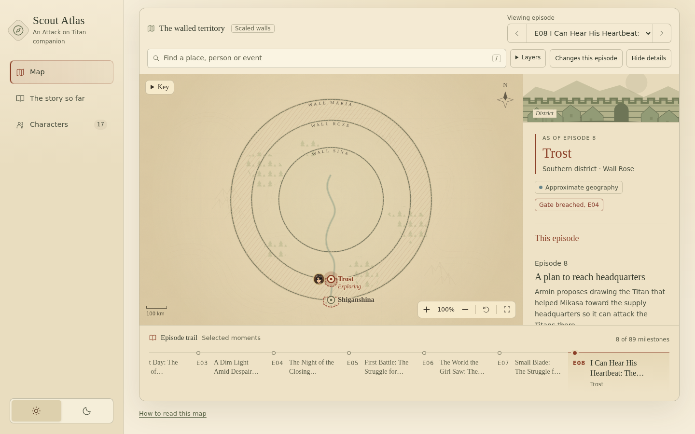
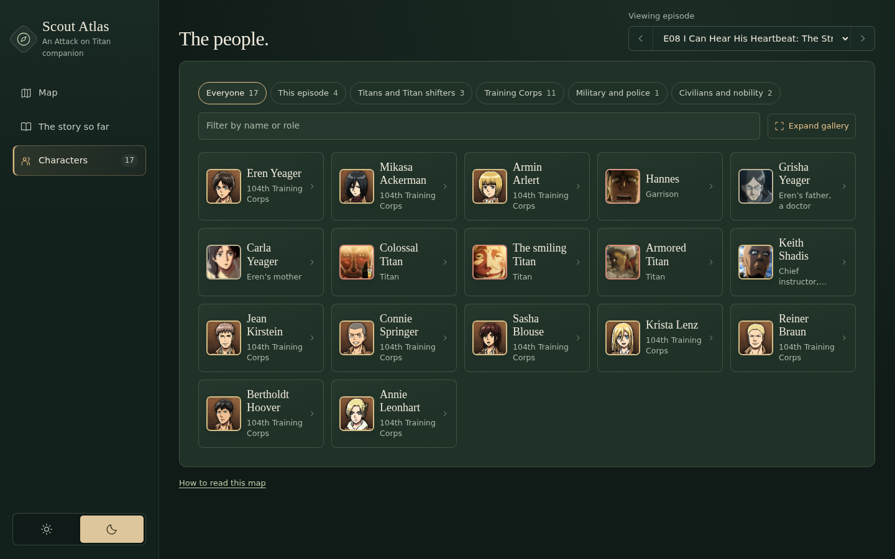

# Scout Atlas

**Open it: <https://paulius11.github.io/scout-atlas/>**

> *Field report, Survey Corps Research Division. Filed by Squad Leader Hange Zoë.*
> *Do not let Levi near this document with a mop.*

**To whoever finds this report,**

Listen. *Listen.* The hardest part of an expedition is not the Titans. It is the **paperwork**. Where were we? Who was standing where? Which gate fell in which week? Commander Erwin wants answers, Levi wants the floor clean, and I want to know *everything*. So now we have an atlas.



### What I observed

- **The Walls, to scale.** Maria at 480 km, Rose at 380, Sina at 250. Perfect circles! *Perfect!* I have so many questions.
- **One dial controls the whole truth.** Pick your **Viewing episode** and the atlas shows only what you already know. Anything later stays behind the wall. I tried to peek. It would not let me. Rude. Admirable, but rude.
- **A face on the map means "last seen here."** If nobody knows where someone went, they get no pin. We do not guess.
- **Confirmed, believed, approximate.** A dashed ring means *roughly here*. More honest than most officers' reports.
- **The story so far.** A recap for every episode of the TV series, and a gallery that only knows who *you* know.
- **No network, no account, no build step.** It does not even send a carrier pigeon.



Every Titan is a mystery and every map is a promise to come back alive. Choose your episode, keep the spoilers behind the wall, and dedicate your heart.

— *Hange Zoë, Squad Leader, Survey Corps*

### Countersigned

> **Armin Arlert, 104th Training Corps:** I grew up reading a forbidden book about the outside world: oceans, fire water, fields of ice. This atlas is the closest thing to it I have held. It even admits when a distance is only a guess, which that book never did.

> **Captain Levi:** It's clean. No clutter, no network, nothing loaded from strangers. Keep it that way. And wipe your fingerprints off the screen.

> **Commander Erwin Smith:** A soldier who knows only what he has seen makes fewer mistakes than one who learns too much too soon. Set your viewing episode, and advance.

---

## Technical notes

> **Spoiler warning:** the app hides what you have not watched, but the source files do not. `data.js` contains the whole TV story.

### Run locally

Open `index.html` in a browser, or serve the folder:

```bash
python3 -m http.server 8765 --bind 127.0.0.1   # then open http://127.0.0.1:8765
```

Plain HTML, CSS, JavaScript and SVG. No build step or dependencies. A Content-Security-Policy blocks every request outside the folder.

### How it works

- **Viewing episode** filters everything: map, story, characters and search. New visitors start at episode 1.
- Settings (episode, theme, layers, map area) stay in this browser's local storage under `scout-atlas:v1`. Nothing is synced.
- Wall radii follow the scale stated in episode 1. Other distances, terrain and local positions are approximate and labelled as such.
- A portrait on the map marks the **last recorded** position, not live tracking.

### Files

| File | Purpose |
| --- | --- |
| `index.html` | Page structure, map artwork, Content-Security-Policy |
| `styles.css` | Layout, themes, responsive rules |
| `app.js` | Rendering, episode filtering, map camera, local state |
| `data.js` | Episodes, events, places, characters and positions |
| `portraits/` | Character pictures, `portraits.js` manifest and `fetch_portraits.py` |
| `tests/` | `data-lint.cjs` data checks, `browser.cjs` browser checks |
| `docs/` | README screenshots |

`data.js` and `portraits/portraits.js` are classic scripts, so the page works from `file://` as well as HTTP.

### Data model

Every item carries an episode threshold, and the app shows only items at or before the viewing episode.

```js
{
  maxEpisode: 89,
  episodes: [{ number: 4, title: "…", events: [{ locationId: "trost", people: ["eren"], kind: "confirmed" }] }],
  locations: [{ id: "trost", name: "Trost", firstEpisode: 4, x: 600, y: 721.6667 }],
  characters: [{ id: "eren", firstEpisode: 1, name: [{ from: 1, text: "Eren Yeager" }], positions: [] }],
  status: [{ target: "gate:trost", from: 4, state: "breached" }]
}
```

- `kind` is `confirmed`, `belief` or `approximate`.
- Versioned fields such as `name`, `role` and `faction` use the latest entry at or before the viewing episode.
- The two final specials are ordered as 88 and 89 and shown as **SP1** and **SP2**.

### Portraits

Official and fan-database art, kept for personal use. Each picture has its own episode threshold, and a silhouette appears before it. To refresh the images (needs Pillow and network access) or rebuild only the manifest:

```bash
python3 portraits/fetch_portraits.py
python3 portraits/fetch_portraits.py --manifest-only
```

### Checks

```bash
node tests/data-lint.cjs    # data and spoiler-boundary checks, no browser
node tests/browser.cjs      # needs the playwright npm package and Chrome (CHROME=/path to override)
ATLAS_URL=http://127.0.0.1:8765 node tests/browser.cjs
```

The data lint fails if any text visible at episode N names something the atlas introduces only after N.

### Sources

Recaps are short original paraphrases checked against the official [shingeki.tv](https://shingeki.tv/) episode pages and episode references. External pages are not limited by your viewing episode, so the app never fetches or links them.
